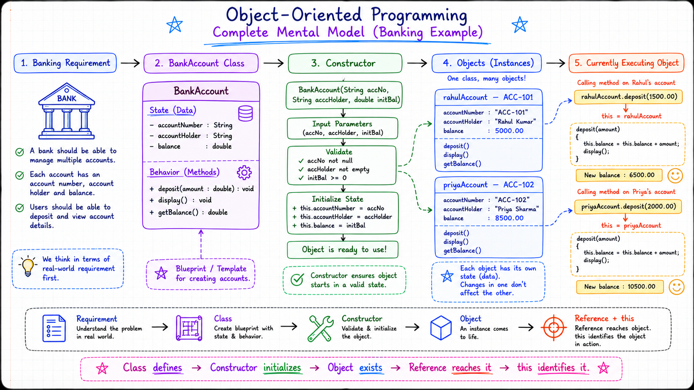
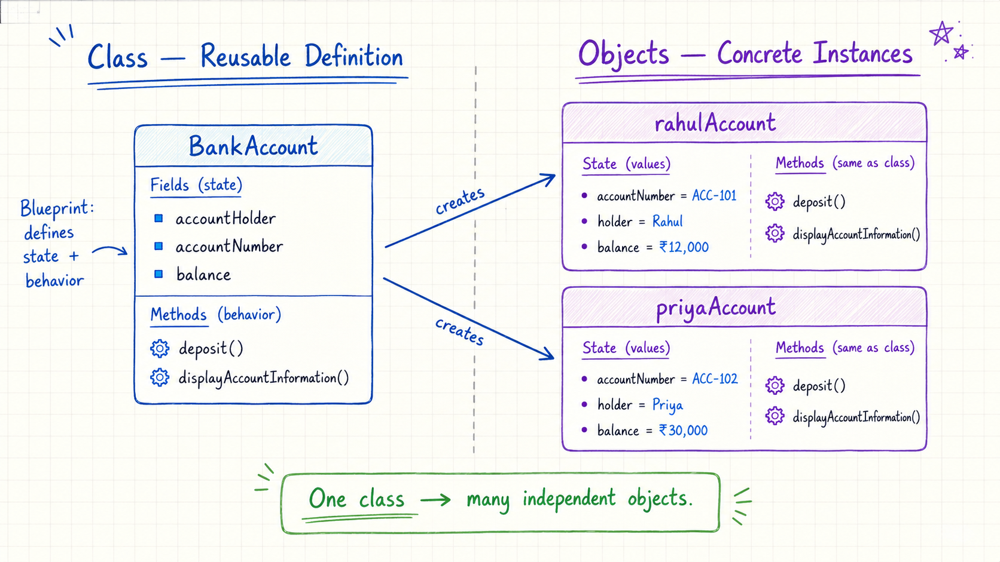
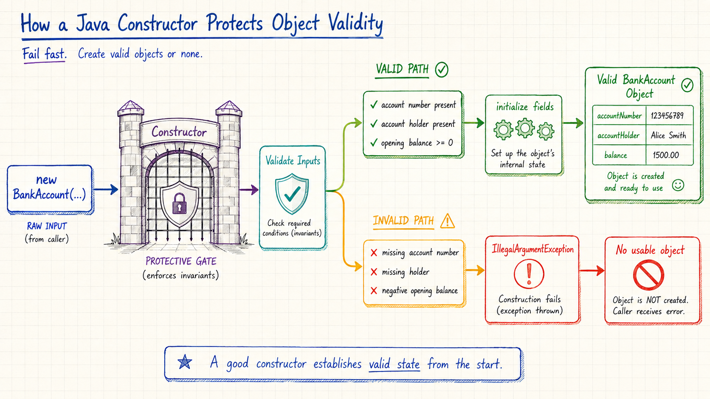
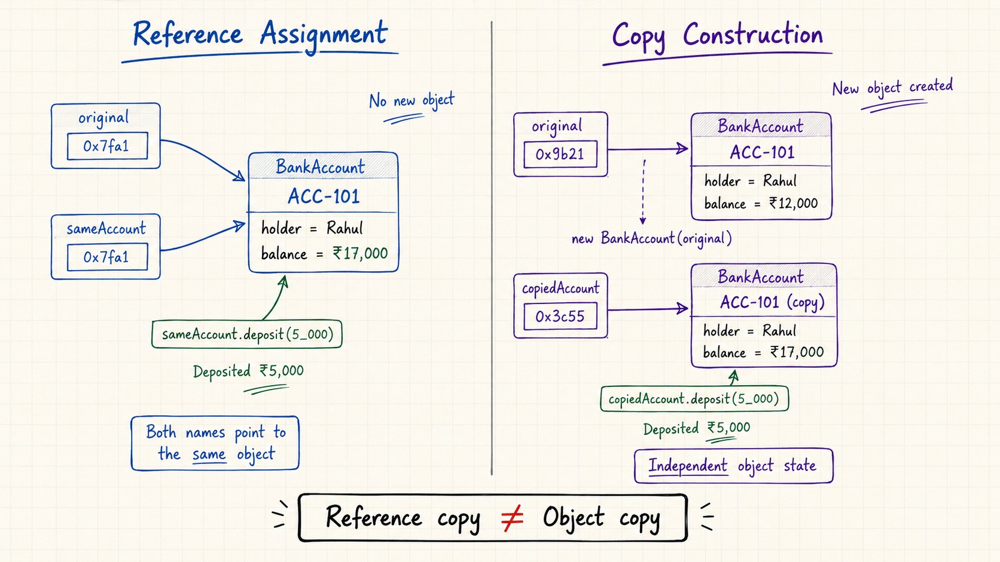
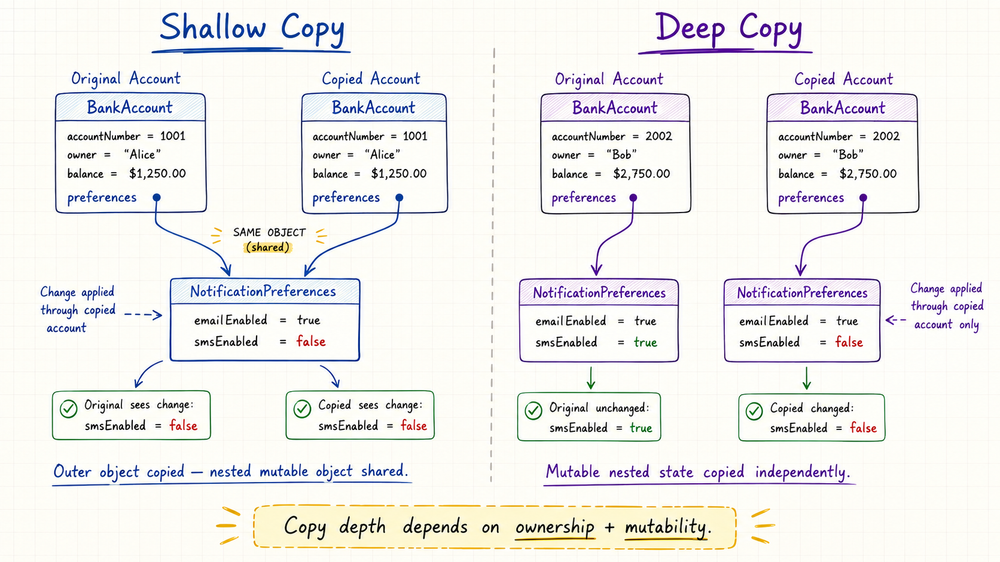
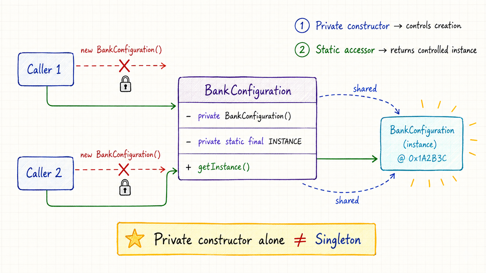
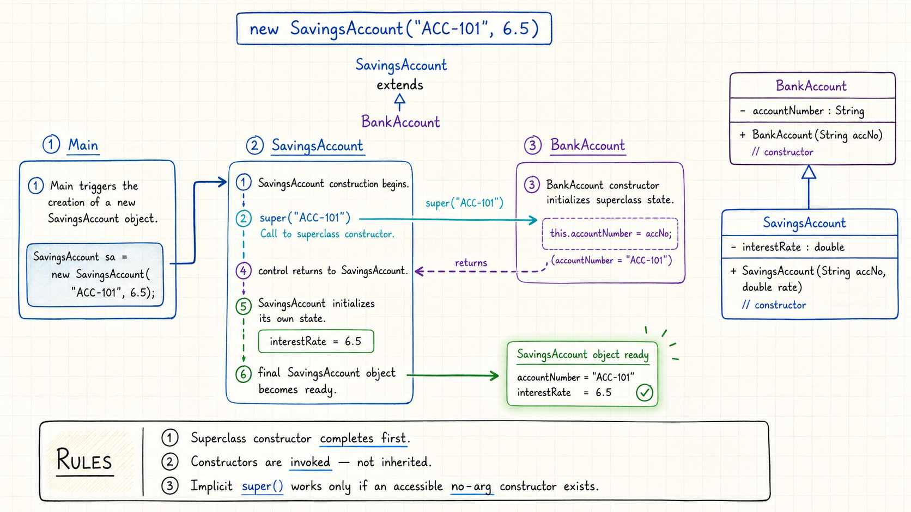
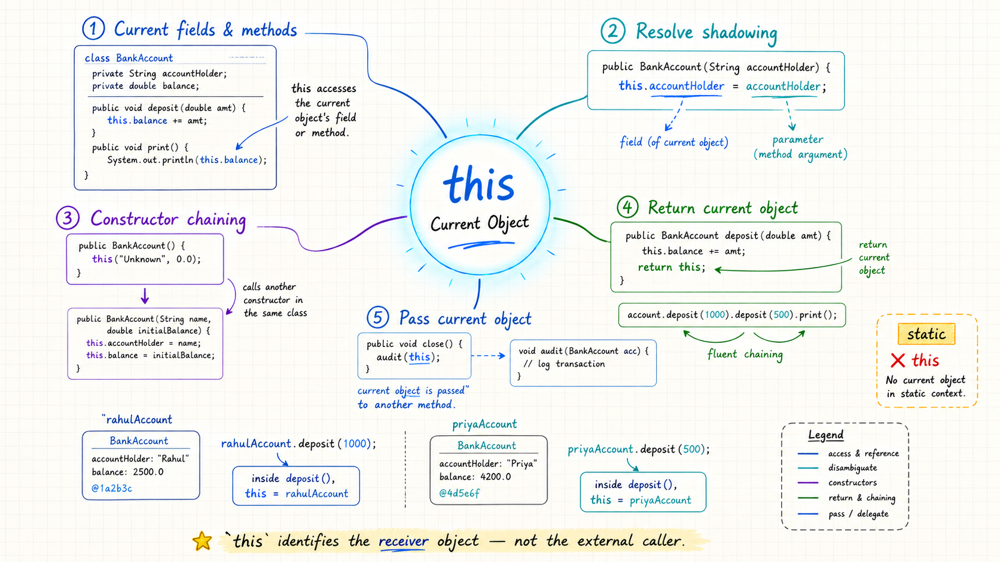

> New to LLD? Start with the [Low Level Design roadmap](/posts/low-level-design-roadmap/), then use this guide to build your Java foundations.

Object-Oriented Programming (OOP) becomes much easier when we stop treating it as a list of definitions and start seeing it as a way to model a real system.

Imagine that we are designing a banking application. The system must represent accounts, remember each account's data, and support actions such as depositing money or displaying account details. OOP helps us place that data and behavior inside meaningful software objects. 🏦

This article builds that foundation step by step. We will learn:

- what OOP means in Low-Level Design (LLD),
- how classes and objects work together,
- how constructors create valid objects,
- how object references and copying behave,
- how private constructors control object creation, and
- how the `this` keyword identifies the current object.

The focus is not memorizing syntax. The goal is to understand the decisions well enough to explain and apply them in an LLD interview.

---

## 🎯 Why This Matters in LLD Interviews

An LLD interview is about turning requirements into objects with clear responsibilities and relationships. Before discussing SOLID principles or design patterns, you must be comfortable with the building blocks used to express the design.

For example, if an interviewer asks you to design a banking system, they expect you to reason about questions such as:

- What should a `BankAccount` object know?
- What operations should it perform?
- How should an account be initialized?
- How do we prevent an invalid account from being created?
- When do two variables refer to the same account object?
- Should object creation be public or controlled?

These questions are really testing your understanding of classes, objects, constructors, references, and `this`.

### How Interviewers Evaluate This Topic

Interviewers usually look for four things:

1. **Correct modeling:** You can translate a real requirement into state and behavior.
2. **Valid object creation:** Your constructors establish meaningful object state.
3. **Reference awareness:** You understand identity, mutation, shallow copies, and deep copies.
4. **Clear explanation:** You can explain why a design works instead of only writing syntax.

> **Interview mindset:** Do not begin by creating many classes. First identify the important objects, their responsibilities, and the rules that must always remain true.

---

## 🧭 The Mental Model: From Blueprint to Working Object

A class describes a type of thing. An object is one concrete instance of that class. A constructor supplies the starting data, while `this` refers to the particular object currently executing the code.



Keep this picture in mind as we examine each part.

---

## 1. 🧩 What Object-Oriented Programming Means

Object-Oriented Programming organizes a system around objects. Each object combines **state** with the **behavior** that operates on that state.

In our banking example:

- An account number, account holder, and balance represent **state**.
- Depositing money and displaying account details represent **behavior**.
- A `BankAccount` class describes what every bank-account object should contain and do.

This approach divides a large application into smaller, focused pieces that can collaborate.

### Example

```java
class BankAccount {

    // State: data remembered by each account object
    private String accountNumber;
    private String accountHolder;
    private double balance;

    BankAccount(
            String accountNumber,
            String accountHolder,
            double openingBalance
    ) {
        this.accountNumber = accountNumber;
        this.accountHolder = accountHolder;
        this.balance = openingBalance;
    }

    // Behavior: an operation performed by the account
    void deposit(double amount) {
        balance += amount;
    }

    void displayAccountInformation() {
        System.out.println(accountNumber + " | "
                + accountHolder + " | ₹" + balance);
    }
}
```

> **Production note:** `double` keeps these introductory examples easy to read. Real financial applications normally use `BigDecimal` or an integer representing the smallest currency unit because binary floating-point values can introduce rounding errors.

### Why OOP Helps

OOP can make a system:

1. **Modular:** Each class owns a focused part of the problem.
2. **Reusable:** One class definition can create many objects.
3. **Maintainable:** Related state and behavior remain together.
4. **Scalable:** New objects and behaviors can be added without duplicating the entire design.

### Interview Understanding

- OOP models a system using objects that interact.
- An object combines state and behavior.
- Good OOP does not mean creating a class for everything; it means assigning clear responsibilities to useful abstractions.

---

## 2. 📋 Classes: The Reusable Definition

A class is a blueprint or template for creating objects. It defines the data an object can store and the actions it can perform.

Imagine that a bank wants to open thousands of accounts. Every account needs the same general structure, so writing separate code for every customer would make no sense. Instead, the bank defines one `BankAccount` class and creates many objects from it.

The class describes what a bank account should look like, but the class itself is not Rahul's or Priya's account. It is the reusable definition. 🏗️

### 🔑 Key Characteristics of a Class

1. **Fields or attributes:** Store the state of an object. 📝
2. **Methods:** Define the operations an object can perform. 🔧
3. **Constructors:** Initialize new objects. 🛠️
4. **Reusability:** One class can create many objects with different data. ♻️

### Example

```java
class BankAccount {

    // Fields define the structure and state.
    private String accountHolder;
    private String accountNumber;
    private double balance;

    // The constructor initializes a new object.
    BankAccount(
            String accountHolder,
            String accountNumber,
            double openingBalance
    ) {
        this.accountHolder = accountHolder;
        this.accountNumber = accountNumber;
        this.balance = openingBalance;
    }

    // Methods define behavior.
    void deposit(double amount) {
        balance += amount;
    }

    void displayAccountInformation() {
        System.out.println("Account holder: " + accountHolder);
        System.out.println("Account number: " + accountNumber);
        System.out.println("Balance: ₹" + balance);
    }
}
```

Here:

- `accountHolder`, `accountNumber`, and `balance` are fields.
- `deposit()` and `displayAccountInformation()` are methods.
- `BankAccount(...)` is a constructor.

### Why It Matters

Without a reusable class, developers would repeat the same fields and operations for every account. A class gives us one central definition that can be tested, maintained, and reused.

### 🎯 Interview Understanding

- A class is a definition, not an individual object.
- Fields represent state; methods represent behavior.
- One class can create any number of objects.
- A useful class normally has a clear and cohesive responsibility.

---

## 3. ⚡ Objects: Bringing the Class to Life

An object is a specific instance of a class. It follows the structure defined by its class but holds its own data.

Rahul's account and Priya's account can both be `BankAccount` objects. They support the same operations, yet each has its own account number, holder, and balance.

### 🔑 Key Characteristics of an Object

1. **State:** The actual values held in its fields.
2. **Behavior:** The methods it can execute.
3. **Identity:** Its distinct identity as an object in memory.
4. **Reference:** The value through which Java code reaches the object.

### Example

```java
public class Main {

    public static void main(String[] args) {
        BankAccount rahulAccount =
                new BankAccount("Rahul", "ACC-101", 10_000.00);

        BankAccount priyaAccount =
                new BankAccount("Priya", "ACC-102", 25_000.00);

        // The same method operates on two different objects.
        rahulAccount.deposit(2_000.00);
        priyaAccount.deposit(5_000.00);

        rahulAccount.displayAccountInformation();
        System.out.println();
        priyaAccount.displayAccountInformation();
    }
}

class BankAccount {

    private String accountHolder;
    private String accountNumber;
    private double balance;

    BankAccount(
            String accountHolder,
            String accountNumber,
            double openingBalance
    ) {
        this.accountHolder = accountHolder;
        this.accountNumber = accountNumber;
        this.balance = openingBalance;
    }

    void deposit(double amount) {
        balance += amount;
    }

    void displayAccountInformation() {
        System.out.println("Account holder: " + accountHolder);
        System.out.println("Account number: " + accountNumber);
        System.out.println("Balance: ₹" + balance);
    }
}
```

Output:

```text
Account holder: Rahul
Account number: ACC-101
Balance: ₹12000.0

Account holder: Priya
Account number: ACC-102
Balance: ₹30000.0
```

Both objects use the same class definition and methods, but each method call operates on the state of its target object.



### ⚠️ Object Variables Hold References

Creating two reference variables does not necessarily create two objects.

```java
BankAccount first =
        new BankAccount("Rahul", "ACC-101", 10_000.00);

// No new BankAccount object is created.
BankAccount second = first;
```

`first` and `second` now refer to the same object. A mutation through either reference is visible through the other.

```text
first  ──┐
         ├──▶ One BankAccount object (ACC-101)
second ──┘
```

### Why It Matters

A banking application can use one `BankAccount` class to represent thousands of account objects. Reference awareness matters because unintentionally sharing a mutable object can produce surprising changes elsewhere in the system.

**Why Reference Awareness Matters?** 

- **Shared Memory:** Two variables can point to the exact same object in the computer memory.
- **State Change:** Changing a value through one variable changes it for all other variables pointing to that object.
- **Side Effects:** Code in one module updates a balance or status without telling other modules.
- **Bug Creation:** Other parts of the system read the new broken or unexpected data and fail.

**How to Fix and Prevent Issues?**

- **Immutability:** Make objects read-only so code cannot change values after creation.
- **Defensive Copying**: Return a new copy of an object instead of the original reference.
- **Encapsulation:** Hide internal data fields and control access through strict methods.
- **Value Objects:** Use objects defined by their data values rather than memory identity.

### 🎯 Interview Understanding

- A class is the blueprint; an object is an instance.
- Objects of the same class can hold different state.
- An instance method operates on the target object's state.
- A reference variable does not contain the whole object.
- Two variables can point to the same object.

---

## 4. 🛠️ Constructors: Starting an Object Correctly

A constructor is a special declaration in a class that initializes an object during creation. It is invoked automatically as part of a `new` expression.

Its job is more important than simply assigning values. A well-designed constructor establishes the rules that must be true from the moment the object becomes available.

A constructor has the same name as its class and declares no return type, not even `void`.

### 🔑 Key Features of Constructors

1. **Automatic invocation:** A matching constructor runs during object creation. 🔄
2. **No return type:** A constructor does not declare a return type. 🚫
3. **Initialization:** It assigns the object's starting state. 🛠️
4. **Validation:** It can reject invalid input. ✅
5. **Overloading:** A class can offer several construction paths. 🔁
6. **Access control:** A constructor can be `public`, `protected`, package-private, or `private`. 🔐

### Example: Enforcing Valid State

```java
class BankAccount {

    private final String accountNumber;
    private final String accountHolder;
    private double balance;

    BankAccount(
            String accountNumber,
            String accountHolder,
            double openingBalance
    ) {
        if (accountNumber == null || accountNumber.isBlank()) {
            throw new IllegalArgumentException(
                    "Account number is required"
            );
        }

        if (accountHolder == null || accountHolder.isBlank()) {
            throw new IllegalArgumentException(
                    "Account holder is required"
            );
        }

        if (openingBalance < 0) {
            throw new IllegalArgumentException(
                    "Opening balance cannot be negative"
            );
        }

        this.accountNumber = accountNumber;
        this.accountHolder = accountHolder;
        this.balance = openingBalance;
    }

    void displayAccountDetails() {
        System.out.println(accountNumber + " | "
                + accountHolder + " | ₹" + balance);
    }
}
```

This constructor prevents an account from being created without an identity or with a negative opening balance.



### Why Constructors Matter

Constructors help make object creation:

- **Consistent:** Every object follows the same rules.
- **Safe:** Invalid input fails immediately.
- **Readable:** Required data is visible at the creation site.
- **Maintainable:** Initialization logic remains inside the owning class.

### 🎯 Interview Understanding

- A constructor initializes a new object; it is not a normal method.
- It has no declared return type.
- It can validate arguments and throw an exception.
- Constructor overloading provides multiple supported initialization paths.

---

## 5. 🔄 Types and Forms of Constructors

Java commonly uses these constructor forms:

| Constructor form                      | Who provides it? | Main purpose                                                        |
|---------------------------------------|------------------|---------------------------------------------------------------------|
| Compiler-provided default constructor | Java compiler    | Supplies a no-argument construction path when no constructor exists |
| User-defined no-argument constructor  | Developer        | Applies meaningful application defaults                             |
| Parameterized constructor             | Developer        | Accepts required initial data                                       |
| Copy constructor                      | Developer        | Creates a new object from another object's data                     |
| Private constructor                   | Developer        | Restricts and controls object creation                              |

Let's examine them one by one.

### 5.1 Compiler-Provided Default Constructor

If a class declares **no constructors**, the Java compiler supplies a default constructor. For a normal class, it accepts no arguments and attempts to invoke the superclass's no-argument constructor.

Before any constructor body executes, Java assigns standard default values to instance fields.

#### Default Values of Fields

- `byte`, `short`, `int`, and `long` receive `0`.
- `float` and `double` receive `0.0`.
- `boolean` receives `false`.
- `char` receives the null character `\u0000`.
- Object references, including `String`, receive `null`.

These automatic values apply to instance and static fields, not to uninitialized local variables.

#### Example

```java
class BankAccount {

    String accountHolder; // null
    double balance;       // 0.0
    boolean active;       // false

    /*
     * No constructor is declared.
     * The compiler supplies one similar to:
     *
     * BankAccount() {
     *     super();
     * }
     */
}

public class Main {

    public static void main(String[] args) {
        BankAccount account = new BankAccount();

        System.out.println("Account holder: " + account.accountHolder);
        System.out.println("Balance: " + account.balance);
        System.out.println("Active: " + account.active);
    }
}
```

Output:

```text
Account holder: null
Balance: 0.0
Active: false
```

Java can create the object, but an account with no holder may not represent a meaningful business state.

#### ⚠️ Default Constructor vs. No-Argument Constructor

A **default constructor** is specifically generated by the compiler.

A **no-argument constructor** is any constructor that accepts zero parameters. If a developer writes it, it is a user-defined no-argument constructor, not a compiler-provided default constructor.

This wording distinction is a common interview question.

### 5.2 User-Defined No-Argument Constructor

A user-defined no-argument constructor gives the developer control over the object's initial state.

#### Example

```java
class BankAccount {

    private String accountNumber;
    private String accountHolder;
    private double balance;
    private boolean active;

    BankAccount() {
        this.accountNumber = "UNASSIGNED";
        this.accountHolder = "Pending Customer";
        this.balance = 0.0;
        this.active = false;
    }

    void displayAccountDetails() {
        System.out.println("Account number: " + accountNumber);
        System.out.println("Account holder: " + accountHolder);
        System.out.println("Balance: ₹" + balance);
        System.out.println("Active: " + active);
    }
}
```

Now the object starts with explicit application values instead of `null`.

> Use this approach only when the chosen defaults represent a valid or intentionally pending business state. Required data should not be hidden behind convenient defaults.

### 5.3 Parameterized Constructor

A parameterized constructor accepts data from the caller and uses it to initialize the object.

#### Example

```java
class BankAccount {

    private final String accountNumber;
    private final String accountHolder;
    private double balance;

    BankAccount(
            String accountNumber,
            String accountHolder,
            double openingBalance
    ) {
        if (accountNumber == null || accountNumber.isBlank()) {
            throw new IllegalArgumentException("Account number is required");
        }
        if (accountHolder == null || accountHolder.isBlank()) {
            throw new IllegalArgumentException("Account holder is required");
        }
        if (openingBalance < 0) {
            throw new IllegalArgumentException(
                    "Opening balance cannot be negative"
            );
        }

        this.accountNumber = accountNumber;
        this.accountHolder = accountHolder;
        this.balance = openingBalance;
    }
}
```

A parameterized constructor makes the required input visible at the call site:

```java
BankAccount rahulAccount =
        new BankAccount("ACC-101", "Rahul", 10_000.00);

BankAccount priyaAccount =
        new BankAccount("ACC-102", "Priya", 25_000.00);
```

This is usually safer than creating an empty object and hoping that every required setter is called later.

### 5.4 Copy Constructor

A copy constructor creates a new object using data from another object of the same class.

Java does not generate copy constructors automatically. It is an ordinary constructor whose copying behavior is written by the developer.

#### Example

```java
class BuildConfig {

    private String environment;
    private int timeoutSeconds;
    private boolean debugEnabled;

    BuildConfig(
            String environment,
            int timeoutSeconds,
            boolean debugEnabled
    ) {
        this.environment = environment;
        this.timeoutSeconds = timeoutSeconds;
        this.debugEnabled = debugEnabled;
    }

    // Copy constructor
    BuildConfig(BuildConfig other) {
        this.environment = other.environment;
        this.timeoutSeconds = other.timeoutSeconds;
        this.debugEnabled = other.debugEnabled;
    }

    void setEnvironment(String environment) {
        this.environment = environment;
    }

    void setDebugEnabled(boolean debugEnabled) {
        this.debugEnabled = debugEnabled;
    }

    String getEnvironment() {
        return environment;
    }

    boolean isDebugEnabled() {
        return debugEnabled;
    }
}
```

```java
BuildConfig production =
        new BuildConfig("production", 300, false);

BuildConfig staging = new BuildConfig(production);

staging.setEnvironment("staging");
staging.setDebugEnabled(true);

System.out.println(production.getEnvironment());   // production
System.out.println(production.isDebugEnabled());   // false

System.out.println(staging.getEnvironment());      // staging
System.out.println(staging.isDebugEnabled());      // true
```

The `staging` configuration starts with the same values as `production`, but it is a separate object. Changes made to the copied object do not modify the original object.

---

## 6. 🔗 Reference Assignment vs. Copy Construction

Reference assignment and object copying look similar, but they produce very different results.

```java
BankAccount original =
        new BankAccount("ACC-101", "Rahul", 10_000.00);

// Reference assignment: no new object
BankAccount sameAccount = original;

// Copy construction: requires a BankAccount(BankAccount other)
// constructor, as shown in the shallow/deep copy examples below.
BankAccount copiedAccount = new BankAccount(original);
```



### The Difference

| Operation                                      | Creates a new object? | What is shared?                                | Effect of mutation                                     |
|------------------------------------------------|----------------------:|------------------------------------------------|--------------------------------------------------------|
| `BankAccount second = first;`                  |                    No | The same object                                | A change through either reference affects that object  |
| `BankAccount second = new BankAccount(first);` |                   Yes | Whatever the copy constructor chooses to share | Can be independent if copying is implemented correctly |

### Interview Understanding

- Java variables of class types hold reference values.
- Copying a reference does not clone an object.
- A copy constructor explicitly creates the new object.
- Java is always pass-by-value; for an object argument, the copied value is a reference.

---

## 7. 🪞 Shallow Copy vs Deep Copy

When an object contains another **mutable object**, copying becomes slightly more interesting.

The main question is:

> Should the original and copied object share the same nested object, or should each one get its own copy?

That is the difference between a **shallow copy** and a **deep copy**.

---

## Shallow Copy

A **shallow copy** creates a new outer object, but it reuses the same nested object.

So the original and the copy are separate `BankAccount` objects, but both point to the same `NotificationPreferences`.

### Example

```java
class NotificationPreferences {

    private boolean smsEnabled;

    NotificationPreferences(boolean smsEnabled) {
        this.smsEnabled = smsEnabled;
    }

    void setSmsEnabled(boolean smsEnabled) {
        this.smsEnabled = smsEnabled;
    }

    boolean isSmsEnabled() {
        return smsEnabled;
    }
}

class BankAccount {

    private final String accountNumber;
    private final NotificationPreferences preferences;

    BankAccount(
            String accountNumber,
            NotificationPreferences preferences
    ) {
        this.accountNumber = accountNumber;
        this.preferences = preferences;
    }

    // Shallow-copy constructor
    BankAccount(BankAccount other) {
        this.accountNumber = other.accountNumber;

        // The same NotificationPreferences object is reused.
        this.preferences = other.preferences;
    }

    NotificationPreferences getPreferences() {
        return preferences;
    }
}

public class Main {

    public static void main(String[] args) {

        BankAccount original = new BankAccount(
                "ACC-101",
                new NotificationPreferences(true)
        );

        BankAccount copy = new BankAccount(original);

        copy.getPreferences().setSmsEnabled(false);

        System.out.println(
                original.getPreferences().isSmsEnabled()
        );

        System.out.println(
                copy.getPreferences().isSmsEnabled()
        );
    }
}
```

### Output

```text
false
false
```

Why did the original also become `false`?

Because both accounts share the same `NotificationPreferences` object.

```text
original ──┐
           ├──> NotificationPreferences
copy ──────┘
```

Changing the preferences through `copy` changes the same object that `original` is using.

### Easy way to remember

```text
Shallow Copy
New outer object
Same inner object
```

---

## Deep Copy

A **deep copy** creates a new outer object and also creates a separate copy of the nested mutable object.

Now the original and copied `BankAccount` objects each have their own `NotificationPreferences`.

### Example

```java
class NotificationPreferences {

    private boolean smsEnabled;

    NotificationPreferences(boolean smsEnabled) {
        this.smsEnabled = smsEnabled;
    }

    // Copy constructor for the nested object
    NotificationPreferences(NotificationPreferences other) {
        this.smsEnabled = other.smsEnabled;
    }

    void setSmsEnabled(boolean smsEnabled) {
        this.smsEnabled = smsEnabled;
    }

    boolean isSmsEnabled() {
        return smsEnabled;
    }
}

class BankAccount {

    private final String accountNumber;
    private final NotificationPreferences preferences;

    BankAccount(
            String accountNumber,
            NotificationPreferences preferences
    ) {
        this.accountNumber = accountNumber;
        this.preferences = preferences;
    }

    // Deep-copy constructor
    BankAccount(BankAccount other) {
        this.accountNumber = other.accountNumber;

        // A new NotificationPreferences object is created.
        this.preferences =
                new NotificationPreferences(other.preferences);
    }

    NotificationPreferences getPreferences() {
        return preferences;
    }
}

public class Main {

    public static void main(String[] args) {

        BankAccount original = new BankAccount(
                "ACC-101",
                new NotificationPreferences(true)
        );

        BankAccount copy = new BankAccount(original);

        copy.getPreferences().setSmsEnabled(false);

        System.out.println(
                original.getPreferences().isSmsEnabled()
        );

        System.out.println(
                copy.getPreferences().isSmsEnabled()
        );
    }
}
```

### Output

```text
true
false
```

This time, changing the copied account does not affect the original.

That is because each account has its own `NotificationPreferences` object.

```text
original ───> NotificationPreferences(true)

copy ───────> NotificationPreferences(false)
```
---

## Shallow Copy vs Deep Copy

| Shallow Copy                                            | Deep Copy                     |
|---------------------------------------------------------|-------------------------------|
| Creates a new outer object                              | Creates a new outer object    |
| Reuses nested object references                         | Copies nested mutable objects |
| Changes to shared nested objects can affect both copies | Changes remain independent    |
| Usually simpler and cheaper                             | Requires additional copying   |

The key idea is simple:

> **Shallow copy shares nested objects. Deep copy duplicates the nested mutable objects that should be independent.**




### 🔑 Copying Rules to Remember

1. Primitive values are copied directly.
2. Immutable objects such as `String` can usually be shared safely.
3. Mutable nested objects may require independent copies.
4. A copy constructor may perform a shallow or deep copy.
5. The required copy depth depends on ownership and mutability.
6. Deep-copying every object can be unnecessary and expensive.

### Why It Matters in Backend Design

Unexpected sharing of mutable objects creates subtle bugs. A change to copied notification preferences should not silently change the original account's configuration.

---

## 8. 🔐 Private Constructors and Controlled Object Creation

A private constructor cannot be called directly from outside its class. This gives the class control over when and how its objects are created.

Private constructors are commonly used with:

- static factory methods,
- Singleton implementations,
- cached or controlled object creation, and
- utility classes that should never be instantiated.

### Example: One Bank Configuration Object

```java
final class BankConfiguration {

    /*
     * Java's class-initialization rules make this eager
     * initialization thread-safe.
     */
    private static final BankConfiguration INSTANCE =
            new BankConfiguration();

    // Outside code cannot call new BankConfiguration().
    private BankConfiguration() {
    }

    static BankConfiguration getInstance() {
        return INSTANCE;
    }
}

public class Main {

    public static void main(String[] args) {
        BankConfiguration first =
                BankConfiguration.getInstance();

        BankConfiguration second =
                BankConfiguration.getInstance();

        System.out.println(first == second); // true
    }
}
```

Both variables refer to the same `BankConfiguration` object.

A good mental model is to separate three things: **class loading**, **class initialization**, and **object creation**.

```text
1. Class Loading
   JVM reads BankConfiguration.class

2. Class Initialization
   JVM initializes static fields
   ↓
   INSTANCE = new BankConfiguration()

3. Object Creation
   new BankConfiguration() creates the actual object
```


When the class is used for the first time, such as:

```java
BankConfiguration.getInstance();
```

the JVM checks whether `BankConfiguration` has already been initialized.

If it has not, the JVM must initialize it before executing the static method normally.

Conceptually:

```text
Thread A                         Thread B
   |                               |
   | getInstance()                 | getInstance()
   |                               |
   +---------- both reach ---------+
               class
            initialization
                 |
                 v
          JVM initialization
              mechanism
           /             \
          /               \
Thread A allowed       Thread B waits
to initialize
     |
     v
static fields initialized

INSTANCE =
new BankConfiguration()
     |
     v
class initialization
is complete
     |
     +------------------+
     |                  |
Thread A continues   Thread B continues
     |                  |
     v                  v
  INSTANCE           INSTANCE
```

The JVM specification guarantees that **a class is initialized by only one thread at a time**. Internally, you can think of the JVM as having an initialization lock associated with that class. One thread performs the initialization; other threads trying to initialize that same class wait until it finishes.




### A Private Constructor Does Not Automatically Make a Class Singleton

A **private constructor** only means that other classes cannot create objects using `new`.

To make a class a **Singleton**, it must also:

- keep one instance of itself,
- provide a method to access that instance,
- always return the same instance, and
- make sure multiple threads cannot accidentally create multiple instances (thread safety).

**Simple idea:**

> Private constructor = controls object creation.  
> Singleton = controls object creation **and guarantees only one shared instance**.


### Why It Matters

Controlled construction is useful when creation requires restrictions, naming, caching, reuse, or special validation. It should not be used merely to make every object globally available.

### 🎯 Interview Understanding

- A private constructor blocks direct construction from outside the class.
- A static access method works before any caller-owned instance exists.
- The access method may create, cache, or return an existing object.
- A private constructor by itself does not guarantee a Singleton.

---

## 9. 🔁 Constructor Overloading

Constructor overloading means defining multiple constructors in the same class with different parameter lists.

Java selects the matching constructor using the number, types, and order of the supplied arguments.

### Example

```java
class BankAccount {

    private String accountNumber;
    private String accountHolder;
    private double balance;

    BankAccount() {
        this("UNASSIGNED", "Pending Customer", 0.0);
    }

    BankAccount(
            String accountNumber,
            String accountHolder
    ) {
        this(accountNumber, accountHolder, 0.0);
    }

    BankAccount(
            String accountNumber,
            String accountHolder,
            double openingBalance
    ) {
        this.accountNumber = accountNumber;
        this.accountHolder = accountHolder;
        this.balance = openingBalance;
    }
}
```

These constructor signatures are different:

```text
BankAccount()
BankAccount(String, String)
BankAccount(String, String, double)
```

The following pair is illegal because parameter names are not part of a constructor signature:

```java
class InvalidBankAccount {

    InvalidBankAccount(String accountNumber) {
    }

    /*
     * Compilation error: this has the same signature.
     *
     * InvalidBankAccount(String accountHolder) {
     * }
     */
}
```

### 🔑 Key Points

- The constructor name always matches the class name.
- The number, types, or order of parameters must differ.
- Changing only parameter names does not create another signature.
- Overload selection happens at compile time.
- Return type cannot distinguish constructors because constructors declare no return type.

---

## 10. 🔗 Constructor Chaining with `this(...)`

Constructor chaining allows one constructor to delegate to another constructor in the same class using `this(...)`.

This avoids repeated initialization and keeps validation in one central place.


### Example

```java
class BankAccount {

    private final String accountNumber;
    private final String accountHolder;
    private double balance;

    BankAccount(
            String accountNumber,
            String accountHolder
    ) {
        // Delegates to the three-argument constructor.
        this(accountNumber, accountHolder, 0.0);
    }

    BankAccount(
            String accountNumber,
            String accountHolder,
            double openingBalance
    ) {
        if (openingBalance < 0) {
            throw new IllegalArgumentException(
                    "Opening balance cannot be negative"
            );
        }

        this.accountNumber = accountNumber;
        this.accountHolder = accountHolder;
        this.balance = openingBalance;
    }
}
```

### Rules to Remember

- `this(...)` invokes another constructor in the same class.
- Java chooses the target using the arguments supplied.
- These examples put `this(...)` or `super(...)` first to keep constructor flow easy to follow.
- A constructor chain cannot form a cycle.
- A constructor cannot directly invoke both `this(...)` and `super(...)` as constructor-invocation statements.

### Why It Matters

Constructor chaining supports **DRY**, or Don't Repeat Yourself. Centralizing validation and field assignment prevents overloaded constructors from applying different rules accidentally.

> **Java version note:** Java 25 supports flexible constructor bodies. Certain safe statements, such as argument validation, may appear before `this(...)` or `super(...)`. The first-statement style used here remains valid. See [Oracle's guide to flexible constructor bodies](https://docs.oracle.com/en/java/javase/25/language/flexible-constructor-bodies.html).

---

## 11. 👨‍👦 Superclass and Subclass Construction

In the examples below, the subclass calls `super(...)` first. The superclass constructor finishes, then execution continues with the remaining statements in the subclass constructor. Java 25 also allows a restricted prologue before that call, as explained in the version note above.

A subclass does not inherit superclass constructors. It can invoke an accessible superclass constructor using `super(...)`.

### Example

```java
class BankAccount {

    private final String accountNumber;

    BankAccount(String accountNumber) {
        this.accountNumber = accountNumber;
        System.out.println(
                "BankAccount constructor: " + accountNumber
        );
    }
}

class SavingsAccount extends BankAccount {

    private final double interestRate;

    SavingsAccount(
            String accountNumber,
            double interestRate
    ) {
        // The superclass portion is initialized first.
        super(accountNumber);

        this.interestRate = interestRate;
        System.out.println(
                "SavingsAccount constructor: "
                        + interestRate + "%"
        );
    }
}

public class Main {

    public static void main(String[] args) {
        new SavingsAccount("ACC-101", 6.5);
    }
}
```

Output:

```text
BankAccount constructor: ACC-101
SavingsAccount constructor: 6.5%
```



### What If `super(...)` Is Not Written?

When a subclass object is created, Java must initialize the **superclass part first**.

If you do not explicitly write either `this(...)` or `super(...)` inside the subclass constructor, Java automatically tries to insert:

```java
super();
```

For example:

```java
class BankAccount {

    BankAccount(String accountNumber) {
    }
}

class SavingsAccount extends BankAccount {

    SavingsAccount(String accountNumber) {
        // Java tries to insert:
        // super();
    }
}
```

This causes a compilation error because `BankAccount` does not have a no-argument constructor:

```java
BankAccount() {
}
```

It only has:

```java
BankAccount(String accountNumber) {
}
```

So the subclass must explicitly call the available superclass constructor:

```java
class BankAccount {

    BankAccount(String accountNumber) {
    }
}

class SavingsAccount extends BankAccount {

    SavingsAccount(String accountNumber) {
        super(accountNumber);
    }
}
```

### Easy Rule to Remember

> If you write neither `this(...)` nor `super(...)`, Java automatically tries `super()`.

This works only when the superclass has an accessible no-argument constructor.

If the superclass only provides constructors with parameters, the subclass must explicitly call one of them using:

```java
super(arguments);
```

### 🔑 Key Points

- The superclass constructor completes first.
- The statements after `super(...)` run afterward.
- Constructors are not inherited and cannot be overridden.
- `super(...)` invokes an accessible superclass constructor.
- An implicit `super()` works only when an accessible no-argument superclass constructor exists.

---

## 12. 🚫 Constructor Modifier Rules

Constructors can use access modifiers, but Java does not allow them to be declared `final`, `static`, `abstract`, or `synchronized`.

```java
class BankAccount {

    // Valid: constructors may be private.
    private BankAccount() {
    }
}

/*
 * These constructor declarations are illegal:
 *
 * final BankAccount() { }
 * static BankAccount() { }
 * abstract BankAccount();
 * synchronized BankAccount() { }
 */
```

### Why can a constructor not be `final`?

`final` is used to prevent a method from being overridden by a subclass.

Constructors are never inherited and never overridden. A subclass always has its own constructor, even if it calls a superclass constructor.

Therefore, marking a constructor as `final` would serve no purpose.

### Why can a constructor not be `static`?

A `static` member belongs to the class and does not need an object.

A constructor exists specifically to initialize a new object being created.

So their purposes conflict: `static` means no particular object is required, while a constructor always works with a particular new object.

### Why can a constructor not be `abstract`?

An `abstract` method has no implementation and expects a subclass to provide one.

Constructors do not work through overriding. A subclass constructor does not implement or override a superclass constructor.

Also, every constructor that runs must perform real initialization for its own class.

Therefore, an abstract constructor would not fit Java's constructor model.


### Why can a constructor not be `synchronized`?

`synchronized` is used to control concurrent access to a method or block of code that works with shared state.

A constructor is part of creating a new object. Java does not allow the `synchronized` modifier directly on a constructor declaration.

If multiple threads need controlled access to object creation, synchronization should happen around the code that decides when or how the object is created.

For example, the control can happen through:

- safe static initialization,
- a synchronized factory method,
- or explicit locking around shared creation logic.

> **Precise interview answer:** A Java constructor cannot be declared `final`, `static`, `abstract`, or `synchronized`.

---

## 13. ⚠️ Declaring Any Constructor Removes the Compiler-Provided Constructor

As soon as a class declares any constructor, the compiler no longer supplies its default constructor.

If callers still need no-argument construction, the developer must declare that path explicitly.

### Example

```java
class BankAccount {

    private final String accountNumber;

    BankAccount(String accountNumber) {
        this.accountNumber = accountNumber;
    }
}

public class Main {

    public static void main(String[] args) {
        BankAccount first =
                new BankAccount("ACC-101");

        /*
         * Compilation error: BankAccount() does not exist.
         *
         * BankAccount second = new BankAccount();
         */
    }
}
```

If both paths are required, define both:

```java
class BankAccount {

    private final String accountNumber;

    BankAccount() {
        this("UNASSIGNED");
    }

    BankAccount(String accountNumber) {
        this.accountNumber = accountNumber;
    }
}
```

### Interview Understanding

- A parameterized constructor does not preserve an automatic no-argument constructor.
- The compiler adds a default constructor only when no constructor is declared.
- Add an explicit no-argument constructor when the application or framework genuinely needs one.

---

## 14. ↩️ Using `return` Inside a Constructor

A constructor cannot return a value, but it may contain a bare `return;` statement to exit early.

Although legal, early return can leave an object with default or incomplete field values.

### Example

```java
class BankTransaction {

    private double amount; // Starts as 0.0

    BankTransaction(double amount) {
        if (amount < 0) {
            System.out.println("Invalid transaction amount");
            return; // Legal, but the object is still created.
        }

        this.amount = amount;
    }

    double getAmount() {
        return amount;
    }
}

public class Main {

    public static void main(String[] args) {
        BankTransaction validTransaction =
                new BankTransaction(500.00);

        BankTransaction invalidTransaction =
                new BankTransaction(-500.00);

        System.out.println(validTransaction.getAmount());
        System.out.println(invalidTransaction.getAmount());
    }
}
```

Output:

```text
Invalid transaction amount
500.0
0.0
```

The second object still exists, but its `amount` remains at the default value `0.0`.

A safer design normally rejects creation explicitly:

```java
class BankTransaction {

    private final double amount;

    BankTransaction(double amount) {
        if (amount < 0) {
            throw new IllegalArgumentException(
                    "Transaction amount cannot be negative"
            );
        }

        this.amount = amount;
    }
}
```

### Why It Matters

A bare `return;` can hide an initialization failure. Throwing an exception makes it clear that construction did not succeed with the supplied input.

---

## 15. ⚙️ The `this` Keyword: Identifying the Current Object

Inside an instance constructor or method, `this` refers to the current object, meaning the object on which the constructor or method is executing.

Suppose we call:

```java
rahulAccount.deposit(500.00);
```

Inside `deposit()`, `this` refers to the object reached through `rahulAccount`. If we call the same method on `priyaAccount`, `this` refers to Priya's account instead.

This is what allows one method definition to work with many different objects.

### 🔑 Common Uses of `this`

1. Accessing the current object's fields and methods
2. Resolving conflicts between fields and parameters
3. Invoking another constructor with `this(...)`
4. Returning the current object for method chaining
5. Passing the current object to another method



### 15.1 Accessing the Current Object

`this.field` explicitly accesses a field that belongs to the current object.

#### Example

```java
class BankAccount {

    private String accountHolder;
    private double balance;

    BankAccount(
            String accountHolder,
            double balance
    ) {
        this.accountHolder = accountHolder;
        this.balance = balance;
    }

    void displayAccountDetails() {
        System.out.println(
                "Account holder: " + this.accountHolder
        );
        System.out.println(
                "Balance: ₹" + this.balance
        );
    }
}
```

`this.accountHolder` and `this.balance` belong to whichever `BankAccount` object receives the method call.

### 15.2 Resolving Name Conflicts

A parameter or local variable can have the same name as an instance field. In that situation, the nearer variable **shadows** the field.

`this` removes the ambiguity.

#### Example

```java
class BankAccount {

    private String accountHolder;

    BankAccount(String accountHolder) {
        // Current object's field = constructor parameter
        this.accountHolder = accountHolder;
    }
}
```

The two sides mean different things:

- `this.accountHolder` is the instance field.
- `accountHolder` is the constructor parameter.

Without `this`, the following statement would assign the parameter to itself and leave the field unchanged:

```java
accountHolder = accountHolder;
```

### 15.3 Calling Another Constructor

`this(...)` calls another constructor in the same class. This is the constructor chaining we saw earlier.

#### Example

```java
class BankAccount {

    private final String accountNumber;
    private final String accountHolder;
    private double balance;

    BankAccount(
            String accountNumber,
            String accountHolder
    ) {
        this(accountNumber, accountHolder, 0.0);
    }

    BankAccount(
            String accountNumber,
            String accountHolder,
            double openingBalance
    ) {
        this.accountNumber = accountNumber;
        this.accountHolder = accountHolder;
        this.balance = openingBalance;
    }
}
```

Do not confuse the two forms:

- `this` is the current-object reference.
- `this(...)` is an explicit invocation of another constructor in the same class.

### 15.4 Returning the Current Object

An instance method can return `this`. The caller can then invoke another method on the same object, producing a fluent interface or method chain. 🔗

#### Example

```java
class AccountOpeningRequest {

    private String accountHolder;
    private String accountType;
    private double initialDeposit;

    AccountOpeningRequest setAccountHolder(
            String accountHolder
    ) {
        this.accountHolder = accountHolder;
        return this;
    }

    AccountOpeningRequest setAccountType(
            String accountType
    ) {
        this.accountType = accountType;
        return this;
    }

    AccountOpeningRequest setInitialDeposit(
            double initialDeposit
    ) {
        this.initialDeposit = initialDeposit;
        return this;
    }

    void displayRequest() {
        System.out.println(accountHolder + " | "
                + accountType + " | ₹" + initialDeposit);
    }
}

public class Main {

    public static void main(String[] args) {
        AccountOpeningRequest request =
                new AccountOpeningRequest()
                        .setAccountHolder("Rahul")
                        .setAccountType("Savings")
                        .setInitialDeposit(10_000.00);

        request.displayRequest();
    }
}
```

Output:

```text
Rahul | Savings | ₹10000.0
```

Method chaining can make object configuration easy to read. Very long chains, however, can be harder to debug.

### 15.5 Passing the Current Object to Another Method

The current object can be passed to another method by supplying `this` as an argument.

#### Example

```java
class AccountAuditService {

    static void audit(BankAccount account) {
        System.out.println(
                "Auditing account: "
                        + account.getAccountNumber()
        );
    }
}

class BankAccount {

    private final String accountNumber;

    BankAccount(String accountNumber) {
        this.accountNumber = accountNumber;
    }

    String getAccountNumber() {
        return accountNumber;
    }

    void requestAudit() {
        // Passes the current BankAccount object.
        AccountAuditService.audit(this);
    }
}

public class Main {

    public static void main(String[] args) {
        BankAccount account =
                new BankAccount("ACC-101");

        account.requestAudit();
    }
}
```

Output:

```text
Auditing account: ACC-101
```

### ⚠️ Java Is Still Pass-by-Value

Passing `this` does not make Java pass-by-reference.

Java always passes arguments by value. For an object argument, the value being copied is a reference. The original and copied references reach the same object, but the reference value itself was passed by value.

---

**What Is Pass by Value?**

> A method receives a copy of the value stored in the caller's variable. Changing the method parameter does not replace the caller's variable.

---

**Primitive Types**

For primitive types (`int`, `double`, `boolean`, `char`), Java passes a **copy of the actual value**.

```text
number = 10

   copy

value = 10
```

If the method changes:

```text
value = 20
```

the caller still has:

```text
number = 10
```

because only the copied value was changed.

---

**What Happens With Objects?**

An object variable stores a reference to an object in java.

When an object is passed to a method, Java copies the **reference value**.

```text
Caller reference        Method parameter

      |                       |
      +----------+------------+
                 |
                 v
           Same Object
```

Both references point to the same object, so changes made to the object's state are visible to the caller.

If the method changes object fields, the caller sees the change because both references point to the same object.

---

**Reassigning the Method Parameter**

If the method does:

```java
bankAccount = new BankAccount("XYZ");
```

only the method's copied reference changes.

Before:

```text
Caller variable          Method parameter

account                  bankAccount

      \                    /
       \                  /
        v                v

          Original Object
```

After:

```text
Caller variable          Method parameter

account                  bankAccount

   |                         |
   v                         v

Original Object          New Object
```

The caller still points to the original object because only the local copy of the reference was changed.

---

**Notes:**

When we pass an object as a method parameter in Java, a **copy of the object reference** is passed, not the actual object itself. Since both the caller's reference and the method parameter reference point to the same object, any changes made to the object's internal state are visible to the caller as well. This behavior often makes people think that Java uses pass-by-reference.

However, Java is still pass-by-value. The proof is what happens when we reassign the method parameter:

```java
void updateAccount(BankAccount bankAccount) {
    bankAccount = new BankAccount("XYZ");
}
```

Here, only the method's local copy of the reference is changed to point to a new object. The caller's original reference is still pointing to the original `BankAccount` object, so the caller does not see this reassignment.

This shows that Java does not pass the actual reference variable itself. It only passes a copy of the reference value. The copied reference can modify the same object, but changing where that reference points affects only the local method scope. Therefore, Java is **pass-by-value, where the value being copied can be an object reference**.

---

**Why Can People Think Java Is Pass by Reference?**

People often think Java uses pass by reference because when an object is modified inside a method, the caller can see those changes. This happens because Java passes a copy of the object reference, and both the original reference and the copied reference point to the same object.

However, Java is still pass by value. The value being copied is the reference itself, not the actual object. Since both references can access the same object, changes made to the object's internal state are visible to the caller. But if the method changes the reference to point to a completely new object, only the method's local copy is updated, and the caller's original reference remains unchanged.

Therefore, the correct statement is:

> **Java passes object references by value.**

**Final Takeaway**

Java is always **pass by value**. For primitive types, the actual value is copied. For objects, the reference value is copied. Since copied references can point to the same object, a method can modify that object's state, but it cannot change where the caller's original reference points.

> **Java does not pass objects by reference. Java passes a copy of the object's reference by value.**

---

## 16. 🚫 Why `this` Cannot Be Used in a Static Context

A static method belongs to the class rather than to one particular object. Because it can execute without any `BankAccount` instance, no current object exists for `this` to identify.

### Example

```java
class BankAccount {

    private String accountHolder;

    BankAccount(String accountHolder) {
        this.accountHolder = accountHolder;
    }

    void displayAccountHolder() {
        // Valid: this instance method has a receiver object.
        System.out.println(this.accountHolder);
    }

    static void displayBankName() {
        System.out.println("OpenAI Bank");

        /*
         * Compilation error: no current BankAccount exists.
         *
         * System.out.println(this.accountHolder);
         */
    }
}
```

### Explanation

1. `this` refers to the current instance.
2. A static method is associated with the class.
3. Static code can run without a current instance.
4. Therefore, `this` is unavailable in a static context.
5. Static code must receive an object explicitly when it needs instance data.

---

## 17. 👍 Benefits and Risks of `this`

### Benefits

#### 1. Improves Clarity

`this.accountHolder` makes it explicit that the code is accessing the current object's field.

#### 2. Resolves Variable Shadowing

It distinguishes an instance field from a parameter or local variable with the same name.

#### 3. Enables Constructor Chaining

`this(...)` allows constructors to reuse centralized initialization logic.

#### 4. Enables Fluent Method Chaining

Returning `this` allows several related operations to be expressed as one readable chain.

#### 5. Passes the Current Object to a Collaborator

Another method or service can inspect or process the current object.

### Limitations and Risks

#### 1. No Static Context

`this` cannot be used where no receiver object exists.

#### 2. Overuse Can Add Noise

Using `this` everywhere, even when there is no ambiguity, can make straightforward code unnecessarily verbose.

#### 3. Long Chains Can Be Hard to Debug

Fluent APIs are useful, but excessively long chains can hide which operation caused a failure.

#### 4. Letting `this` Escape During Construction Is Dangerous

Passing `this` from a constructor can expose the object before all of its fields have been initialized. Another thread or collaborator may observe partially constructed state.

Avoid publishing `this`, registering listeners, or starting asynchronous work from a constructor unless the lifecycle is carefully controlled.

---

## 18. 🧠 LLD Design Lessons Hidden in These Basics

Classes, objects, constructors, and `this` may look like Java fundamentals, but they express several important design ideas.

### Encapsulation: Protect Valid State

Keep fields private and expose meaningful operations. An account should provide `deposit()` instead of allowing any caller to assign an arbitrary balance.

### High Cohesion: Keep Related Responsibilities Together

Account state and account behavior naturally belong in `BankAccount`. Unrelated responsibilities, such as sending emails, should live in a separate collaborator.

### DRY: Centralize Initialization

Use constructor chaining to keep validation and field assignment in one place.

### KISS: Prefer the Simplest Valid Construction Path

Do not introduce a factory, builder, or Singleton when a clear public constructor is sufficient.

### Fail Fast: Reject Invalid Objects Early

If an account cannot be valid without an account number, reject the missing value in the constructor instead of allowing a broken object to travel through the system.

### Controlled Creation: Use Private Constructors Intentionally

Private constructors are useful when creation must be restricted. They are a design decision, not a default style.

### Practical Design Pattern Connections

The material naturally connects to a few patterns:

- **Builder:** Often returns `this` to create a fluent object-construction API.
- **Static factory method:** A named static method can clarify or control object creation. This is different from the GoF Factory Method pattern, which lets subclasses vary the object being created.
- **Singleton:** Combines restricted construction with controlled access to one instance.

Patterns solve particular design problems. Do not force them into a design that does not need them.

---

## 19. 🎤 Interview Questions and Model Answers

Use these questions to practise saying the answer aloud. In an interview, begin with the direct answer and then give the reason.

### 🟢 Beginner Questions

#### 1. What is a constructor in Java?

A constructor is a special declaration in a class that initializes a newly created object. It has the same name as its class, declares no return type, and runs as part of object creation.

#### 2. Is a constructor a normal method?

No. A constructor looks similar to a method, but it is used during initialization, has no declared return type, is not inherited, and cannot be overridden.

#### 3. What is the difference between a default constructor and a no-argument constructor?

A default constructor is generated by the compiler when no constructor is declared. A no-argument constructor is any constructor with zero parameters and may be written explicitly by the developer.

#### 4. Does Java always provide a default constructor?

No. The compiler provides one only when the class declares no constructors.

#### 5. What happens if a class declares only a parameterized constructor?

The compiler does not add a no-argument constructor. Calling `new BankAccount()` fails to compile unless `BankAccount()` is explicitly declared.

```java
class BankAccount {

    BankAccount(String accountNumber) {
    }
}

/*
 * Compilation error:
 * BankAccount account = new BankAccount();
 */
```

#### 6. Can a class have multiple constructors?

Yes. Constructors can be overloaded using different parameter lists. The number, types, or order of parameters must differ; changing only parameter names is not enough.

#### 7. Can constructors be overloaded or overridden?

Constructors can be overloaded, but they cannot be overridden because they are not inherited.

#### 8. What does `this` mean in Java?

`this` refers to the current receiver object, meaning the object on which the instance constructor or method is executing.

#### 9. Why do we write `this.accountHolder = accountHolder`?

The parameter shadows the field. `this.accountHolder` selects the current object's field, while `accountHolder` refers to the parameter.

#### 10. Can `this` be used in a static method?

No. A static method has no current receiver object, so no `this` reference exists.

### 🟡 Intermediate Questions

#### 11. Can a constructor be `private`?

Yes. A private constructor restricts direct external construction. It is useful for controlled factories, Singleton implementations, and non-instantiable utility classes.

#### 12. Are constructors inherited?

No. A subclass can invoke an accessible superclass constructor using `super(...)`, but it does not inherit that constructor.

#### 13. Which constructor runs first when a subclass object is created?

For the first-statement style used here, the superclass constructor completes first, then the remaining statements in the subclass constructor run.

#### 14. What happens when `super(...)` is not written explicitly?

Java normally attempts an implicit `super()`. Compilation fails if the superclass has no accessible no-argument constructor.

#### 15. Can a constructor return a value?

No. A constructor cannot return a value. It may contain a bare `return;` to exit early, but that can leave the object in an unclear state.

#### 16. Is an early `return;` inside a constructor recommended?

Usually not. Throwing an exception is generally clearer when input is invalid because it prevents the caller from receiving an incompletely initialized object.

#### 17. What is a copy constructor?

It is a developer-defined constructor that accepts another object of the same class and initializes a new object from its data. Java does not generate it automatically.

#### 18. Does a copy constructor always perform a deep copy?

No. It performs exactly the copying logic written by the developer. Nested mutable objects may be shared in a shallow copy or duplicated in a deep copy.

#### 19. What is the difference between reference assignment and copy construction?

Reference assignment creates another reference to the same object:

```java
BankAccount second = first;
```

Copy construction creates a new object:

```java
BankAccount second = new BankAccount(first);
```

#### 20. What is the difference between `this` and `this(...)`?

`this` refers to the current object. `this(...)` invokes another constructor in the same class.

#### 21. What is the difference between `this(...)` and `super(...)`?

`this(...)` delegates to another constructor in the same class. `super(...)` invokes a constructor in the superclass.

#### 22. How does `this` support method chaining?

An instance method can return `this`, allowing another method to be called on the same object.

```java
AccountOpeningRequest request =
        new AccountOpeningRequest()
                .setAccountHolder("Rahul")
                .setAccountType("Savings")
                .setInitialDeposit(10_000.00);
```

### 🔴 Advanced and Concurrency Questions

#### 23. Is passing `this` an example of pass-by-reference?

No. Java is always pass-by-value. Passing `this` copies the reference value; both references then reach the same object.

#### 24. Does `this` refer to the external caller?

No. It refers to the current receiver object. During `rahulAccount.deposit(500)`, `this` inside `deposit()` refers to the account object receiving that call.

#### 25. Can a constructor call both `this(...)` and `super(...)` directly?

No. A constructor body permits at most one explicit constructor invocation: either `this(...)` or `super(...)`. If it delegates with `this(...)`, the constructor chain eventually reaches a superclass constructor. This restriction still applies when statements are allowed before the invocation. See the [Java Language Specification on constructor bodies](https://docs.oracle.com/javase/specs/jls/se25/html/jls-8.html#jls-8.8.7).

#### 26. What is the best short interview definition of a constructor?

> A constructor is a special, non-inherited declaration that runs during object creation to initialize a new instance. It has the same name as its class, declares no return type, can be overloaded, and can delegate using `this(...)` or `super(...)`.

#### 27. Does a private constructor make a lazy Singleton thread-safe?

No. A private constructor only restricts access. Lazy shared initialization still needs safe publication and coordination. Eager static initialization, as shown earlier, relies on Java's thread-safe class initialization.

#### 28. Why is letting `this` escape from a constructor risky?

`this` refers to the current object being created. If it is shared with another thread or object before the constructor finishes, they may see a partially initialized object.

In simple words:

> Do not expose an object before it is fully created.

Example:

```java
class BankAccount {

    private int balance;

    BankAccount(AccountRegistry registry) {
        registry.register(this); // Object escapes

        balance = 1000;
    }
}
```

Here, the object is shared before initialization is complete.

Another component may see:

```text
balance = 0 ❌
```

instead of:

```text
balance = 1000 ✅
```

The object should be completely initialized before it is shared.

---

#### 29. Can synchronizing a normal instance method solve object creation races?

No.

An instance method can use synchronization only after an object already exists. During construction, the object is still being created, so synchronization should be applied to the code that controls object creation, not the constructor itself.

In simple words:

> Protect the object creation process, not the constructor.

Example:

```java
class Singleton {

    private static Singleton instance;

    private Singleton() {
    }

    // Protects usage of an already created object
    synchronized void update() {
        // thread-safe operation
    }

    // Protects object creation
    static synchronized Singleton getInstance() {

        if (instance == null) {
            instance = new Singleton();
        }

        return instance;
    }
}
```

Here:

- `update()` protects access after the object already exists.
- `getInstance()` protects the creation of the shared object.

The synchronization belongs where the shared object is created, not inside the constructor.

---

## 20. ⚠️ Common Mistakes and Confusions

1. Treating a class and an object as the same thing.
2. Calling every zero-parameter constructor a compiler-provided default constructor.
3. Forgetting that any declared constructor removes the compiler-provided constructor.
4. Writing a return type, such as `void`, on a constructor.
5. Believing a constructor can be `final`, `static`, `abstract`, or `synchronized`.
6. Assuming constructors are inherited or overridden.
7. Forgetting that the superclass constructor completes before execution continues after `super(...)`.
8. Believing `BankAccount second = first;` creates another object.
9. Assuming every copy constructor automatically performs a deep copy.
10. Deep-copying everything without considering mutability or ownership.
11. Describing Java object arguments as pass-by-reference.
12. Thinking `this` identifies the external caller instead of the receiver object.
13. Trying to use `this` inside a static method.
14. Writing `accountHolder = accountHolder` when a parameter shadows the field.
15. Returning early from a constructor and leaving unclear object state.
16. Believing a private constructor alone guarantees a Singleton.
17. Passing `this` from a constructor before the object is fully initialized.
18. Using `double` for money in production financial code.
19. Adding fluent chains so long that failures become difficult to locate.
20. Choosing a design pattern before understanding the construction problem.

---

## 21. 🧪 Hands-on Practice Checklist

Try implementing these tasks without copying the examples:

1. Create a `BankAccount` class with private fields and a parameterized constructor.
2. Validate that the account number is present and the opening balance is non-negative.
3. Add a meaningful no-argument constructor.
4. Use `this(...)` to centralize initialization.
5. Create two accounts and prove that they have independent state.
6. Assign one reference to another and observe shared mutation.
7. Implement a copy constructor.
8. Add mutable notification preferences and compare shallow and deep copies.
9. Create a `SavingsAccount` subclass and print constructor execution order.
10. Explain what happens when an accessible `super()` does not exist.
11. Implement a private constructor for `BankConfiguration`.
12. Return `this` from methods of `AccountOpeningRequest`.
13. Pass the current account to an audit service using `this`.
14. Explain why `this` is unavailable inside a static method.
15. Explain why a constructor cannot be declared `synchronized`.
16. Replace example monetary `double` fields with `BigDecimal` or paise stored as `long`.
17. Write a test that proves invalid construction throws an exception.
18. Explain when you would prefer a factory or builder over a public constructor.

---

## 22. ⚡ Quick Revision

- OOP models a system through objects that combine state and behavior.
- A class is a reusable definition; an object is a specific instance.
- Different objects of one class can hold different field values.
- A class-type variable normally stores a reference to an object.
- Two variables can refer to the same mutable object.
- A constructor initializes an object during creation.
- Its name matches the class name, and it declares no return type.
- A constructor should establish valid and consistent state.
- The compiler provides a default constructor only when no constructor is declared.
- A user-defined no-argument constructor is not a compiler-provided default constructor.
- Fields receive default values, but uninitialized local variables do not.
- A parameterized constructor accepts required initial data.
- Constructors can be overloaded but cannot be overridden.
- Declaring any constructor removes the compiler-provided constructor.
- Reference assignment does not create a new object.
- Java does not automatically generate copy constructors.
- A shallow copy may share nested mutable objects.
- A deep copy duplicates the mutable nested state that must be independent.
- A private constructor enables controlled construction but does not alone create a Singleton.
- `this(...)` invokes another constructor in the same class.
- `super(...)` invokes a superclass constructor.
- The superclass constructor completes before the statements following `super(...)`.
- Constructors cannot be `final`, `static`, `abstract`, or `synchronized`.
- A constructor cannot return a value, although a bare `return;` is legal.
- `this` refers to the current receiver object.
- `this.field` resolves field and parameter name conflicts.
- Returning `this` enables method chaining.
- Passing `this` still uses Java's pass-by-value semantics.
- `this` cannot be used in a static context.
- Publishing `this` during construction can expose partially initialized state.

---

## 🏁 Final Takeaway

Classes, objects, constructors, and `this` are not isolated Java keywords. Together, they describe the lifecycle of an object:

1. A **class** defines its possible state and behavior.
2. A **constructor** validates and creates a usable starting state.
3. An **object** carries one concrete identity and set of values.
4. A **reference** allows code to reach that object.
5. **`this`** identifies the object currently executing an instance operation.

When you understand that lifecycle, LLD becomes far more natural. You can model responsibilities clearly, protect invariants at creation time, reason about shared mutable state, and explain your design confidently in an interview. 🚀

## 🔗 Continue learning

If you want a shorter recap, read [Object Oriented Design Fundamentals](/posts/oops-concept/). When these building blocks feel comfortable, move on to [SOLID Principles in Practical Java](/posts/solid-principles-practical-java/).

Use the [LLD roadmap](/posts/low-level-design-roadmap/) to choose your next topic, or browse all [LLD sections](/topics/lld/).
