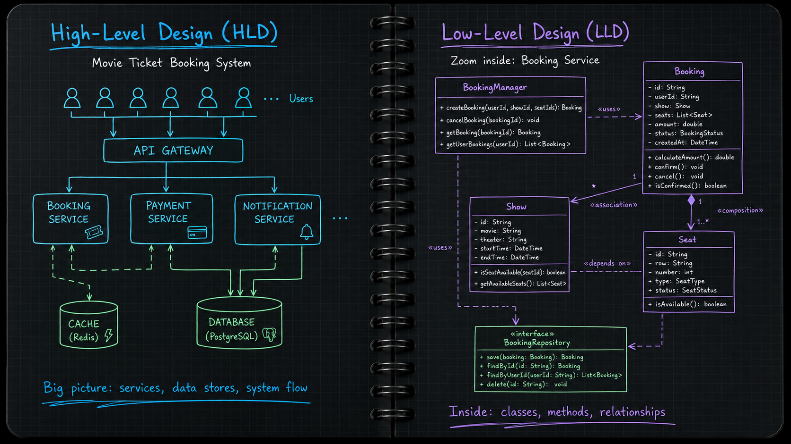
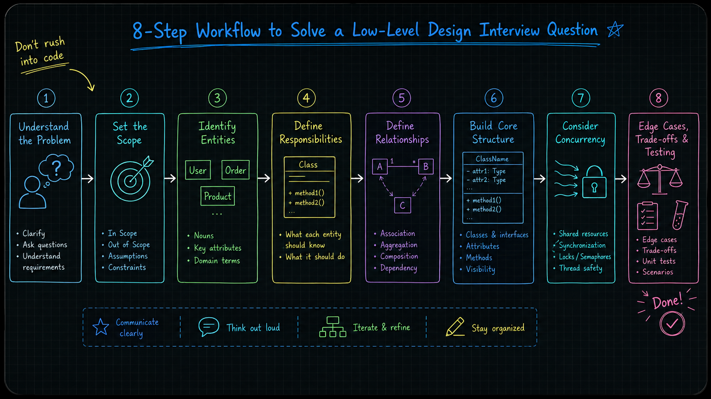
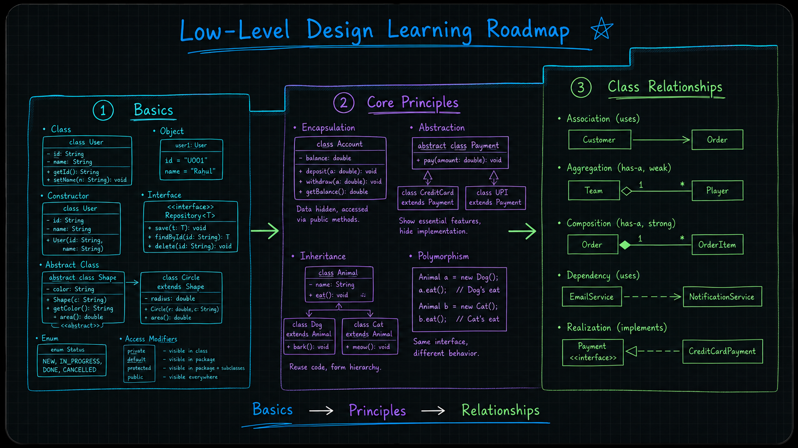
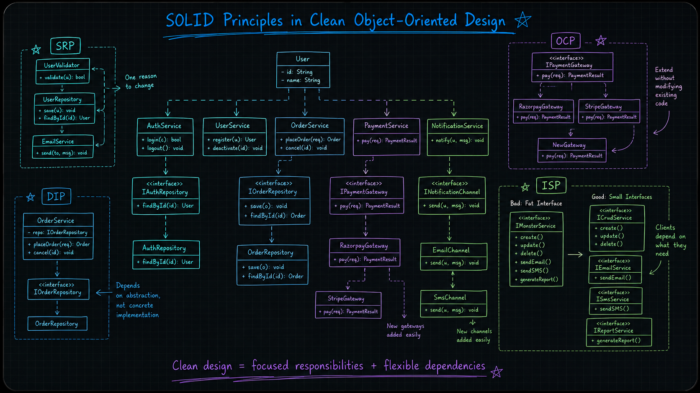
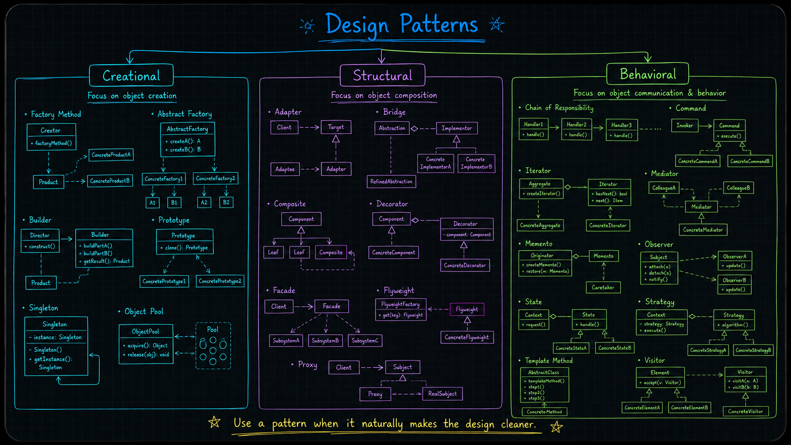
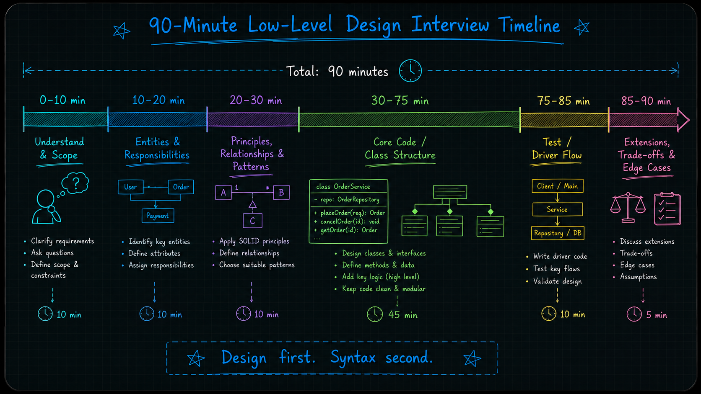
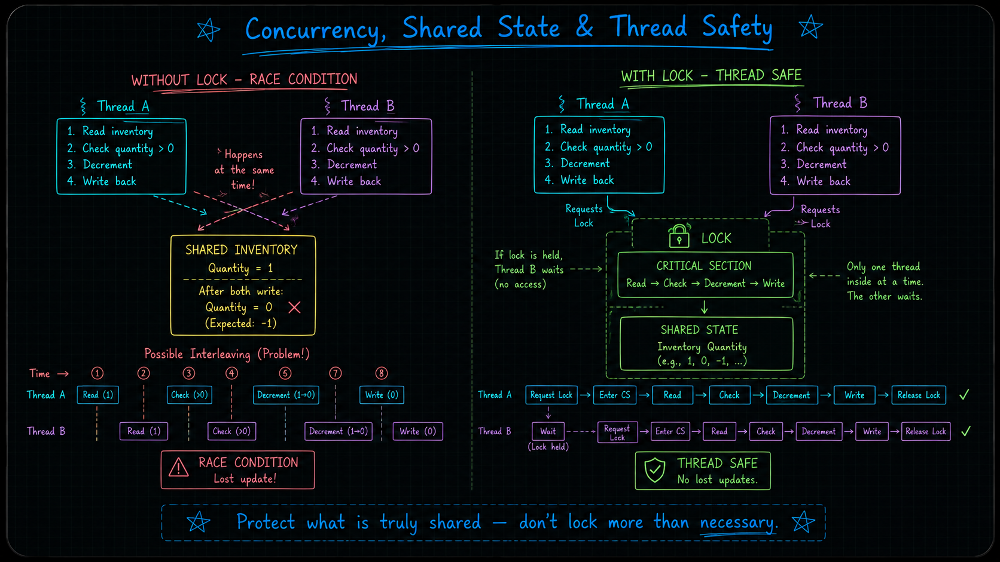

If you’re starting your LLD journey, this series is for you. We will learn each concept step by step, and we will also solve interview-style questions so the ideas stay practical and easy to remember.

This post is the first part of the series, and the goal is simple: help you understand how to think about LLD in a clean, structured, and beginner-friendly way.

***

## What Is Low-Level Design? 🧩

Low-Level Design is about the detailed design of software components. It focuses on classes, objects, interfaces, methods, data models, and how everything works together inside the code.

In simple words, LLD answers questions like:

- What classes do we need?
- What should each class do?
- How should classes talk to each other?
- How do we keep the code easy to read, change, and test?

This is different from High-Level Design, which is more about the bigger picture like services, databases, load balancing, caching, and scalability. LLD is more about the inside of the system, while HLD is more about the outside view.

For example, in a movie ticket booking system:

- HLD decides the overall flow like gateway, service, cache, and database.
- LLD decides the actual classes like `Booking`, `Seat`, `Show`, `Ticket`, and `Payment`.

***

## Why LLD Matters in Interviews 🚀

LLD matters because interviewers want to see how you think, not just whether you can write code. They want to know whether you can break a problem into small parts, assign clear responsibilities, and keep the design clean.

A good LLD answer also shows that you can write code that is easy to extend later. That is important in real projects too, not just interviews.

***

## What Comes in LLD Interviews 👀

In LLD interviews, you can be asked many kinds of things, but they all usually test the same core skill: can you model a real problem properly?

You may be asked about:

- object-oriented thinking,
- class and object design,
- code structure and implementation,
- concurrency and shared data handling,
- design choices and trade-offs,
- and how to keep the solution clean and maintainable.

Sometimes the problem is more like class design. Sometimes it feels like machine coding. Sometimes concurrency becomes important. But the main idea is still the same: understand the problem, design the right objects, and build something practical.

When concurrency is part of the problem, you should think about shared data, locking, race conditions, thread safety, and what can go wrong if two users act at the same time. That is often where good candidates stand out.

***

## How to Approach an LLD Question 🛠️

When you get an LLD problem in an interview, do not rush into code immediately. Start with a simple flow.

1. Understand the problem clearly.
2. Set the scope.
3. Identify the important entities.
4. Define what each entity should be responsible for.
5. Decide the relationships between the entities.
6. Start with the core code or core structure.
7. Keep concurrency in mind if needed.
8. Finish with edge cases, trade-offs, and testing.

A simple example: if you are designing a parking lot system, first decide what the main objects are, like `ParkingLot`, `Floor`, `Spot`, and `Vehicle`. Then think about who manages what. After that, decide how the system should handle full capacity, vehicle types, and concurrent entry or exit.

***

## Evaluation Checklist for Interviewers ✅

Interviewers usually check more than just the final code. They want to see whether your solution is clean, sensible, and practical.

They may look at:

- whether you understood the problem correctly,
- whether your object model makes sense,
- whether you used OOP ideas properly,
- whether your SOLID thinking is visible,
- whether your design choices are simple and well explained,
- whether you handled tricky cases,
- whether your testing approach is reasonable,
- whether your solution stays fast enough for interview time,
- whether you noticed thread safety issues, race conditions, or deadlock risk when relevant,
- and whether the design can grow without becoming messy.

***

## Step-by-Step Learning Path 🛣️

To make LLD easy to understand, we will learn it in **3 building blocks**.

### 1. Basics
Start with the foundation:

- classes and objects,
- constructors,
- interfaces and abstract classes,
- enums and access modifiers.

### 2. Core Principles
Then move to the main object-oriented ideas:

- encapsulation,
- abstraction,
- inheritance,
- polymorphism.

### 3. Class Relationships
After that, learn how classes connect with each other:

- association,
- aggregation,
- composition,
- dependency,
- realization.

> 🎯 Goal: first understand the building blocks, then the principles, and then how classes relate to each other in real systems.

***

## Learn Design Principles

After OOP, focus on writing clean code:

- DRY,
- KISS,
- YAGNI,
- Law of Demeter,
- coupling and cohesion,
- separation of concerns,
- composing objects instead of building everything in one class.

Then learn [SOLID principles with practical Java examples](/posts/solid-principles-practical-java/).

| Principle | Simple meaning                                                         |
|-----------|------------------------------------------------------------------------|
| SRP       | One class should have one clear job.                                   |
| OCP       | Add new behavior without breaking old code.                            |
| LSP       | A child type should behave properly where the parent type is expected. |
| ISP       | Keep interfaces small and focused.                                     |
| DIP       | Depend on abstractions, not hard-coded details.                        |

> 🧪 Tip: learn SOLID with examples, not just definitions.

***

## Learn UML Basics

You do not need to be a UML expert, but these diagrams help a lot:

- class diagram,
- sequence diagram,
- use case diagram,
- activity diagram,
- state machine diagram.

> ✍️ In interviews, a clear explanation in plain English is often more important than a perfect diagram.

***

## Learn Design Patterns

There are 23 GoF design patterns, but in interviews you usually need only a few often. The important part is knowing when a pattern fits and when it does not.

| Pattern        | When to use it                          | Example                      |
|----------------|-----------------------------------------|------------------------------|
| Strategy       | Multiple ways to do the same task       | Payment methods              |
| Observer       | One change should notify many           | Order updates                |
| Factory Method | Object creation depends on input        | Different notification types |
| State          | Behavior changes based on current state | Order lifecycle              |
| Builder        | Create complex objects step by step     | Custom request object        |
| Adapter        | Convert one interface into another      | Third-party API integration  |
| Decorator      | Add behavior without changing the class | Add logging or tax           |
| Singleton      | Only one shared instance is needed      | Config manager               |
| Command        | Turn actions into objects               | Undo/redo                    |
| Composite      | Tree-like structure                     | Files and folders            |

### The 23 GoF design patterns

| Creational Patterns | Structural Patterns | Behavioral Patterns     |
|---------------------|---------------------|-------------------------|
| Factory Method      | Adapter             | Chain of Responsibility |
| Abstract Factory    | Bridge              | Command                 |
| Builder             | Composite           | Iterator                |
| Prototype           | Decorator           | Mediator                |
| Singleton           | Facade              | Memento                 |
|                     | Flyweight           | Observer                |
|                     | Proxy               | State                   |
|                     |                     | Strategy                |
|                     |                     | Template Method         |
|                     |                     | Visitor                 |
|                     |                     | Interpreter             |

The original catalog contains five creational, seven structural, and eleven behavioral patterns. Object Pool is a useful additional pattern, but is not one of the original 23.

### Extra useful patterns

| Pattern                      | When it helps                                                                    |
|------------------------------|----------------------------------------------------------------------------------|
| Object Pool                  | When expensive resources should be reused with controlled borrowing and return. |
| Null Object Pattern          | When you want a safe default instead of null checks.                             |
| Repository Pattern           | When you want to separate data access from business logic.                       |
| MVC Pattern                  | When you want to separate model, view, and controller concerns.                  |
| Dependency Injection Pattern | When you want to pass dependencies from outside instead of creating them inside. |
| Specification Pattern        | When you want flexible filtering or rule-based logic.                            |
| Game Loop Pattern            | When you need repeated update-and-render style processing.                       |
| Thread Loop Pattern          | When a worker thread keeps polling or processing tasks.                          |
| Producer-Consumer Pattern    | When one part generates work and another part consumes it.                       |

### How to choose the right pattern

Do not force a pattern just to impress the interviewer. Use a pattern only when it makes the design cleaner, easier to extend, or easier to explain. If a pattern fits naturally, explain it properly. If not, keep the design simple. That is perfectly fine in this series.

***

## 90-Minute Interview Plan ⏱️

Use this as a sample plan when you have 90 minutes. Adjust the time boxes to the actual interview length and the amount of coding expected.

| Time      | What to do                                        | Why it matters                    |
|-----------|---------------------------------------------------|-----------------------------------|
| 0–10 min  | Understand the problem and clarify scope          | Prevents building the wrong thing |
| 10–20 min | Identify entities and responsibilities            | Gives structure to the solution   |
| 20–30 min | Discuss principles, relationships, and patterns   | Shows design thinking             |
| 30–75 min | Write core code or core class structure           | Proves implementation ability     |
| 75–85 min | Add one test scenario or driver flow              | Shows the design works            |
| 85–90 min | Talk about extensions, trade-offs, and edge cases | Shows maturity and clarity        |

> ⏱️ Time management matters. Do not spend too long on syntax. Focus on the design first.

***

## How to Think About Concurrency 🔒

Concurrency can show up in LLD when multiple users access the same resource at the same time. This is common in booking, counters, queues, reservations, and shared inventory.

When concurrency matters, think about:

- shared state,
- locking,
- race conditions,
- deadlock risk,
- thread safety,
- and how to keep the solution correct under load.

A simple rule is: protect only what is truly shared, and do not lock more than necessary.

***

## Common Mistakes to Avoid ⚠️

- Jumping into code before understanding the problem.
- Making the design too complex early.
- Creating too many classes with unclear jobs.
- Forcing a design pattern where it is not needed.
- Ignoring concurrency when shared resources are present.
- Forgetting to test the main flow.
- Not explaining why a decision was made.
- Mixing high-level architecture details into a low-level design round.

***

## LLD Practice Questions

| Priority | Category                   | Questions                                                                                                                                                                              |
|----------|----------------------------|----------------------------------------------------------------------------------------------------------------------------------------------------------------------------------------|
| **P1**   | Core LLD Systems           | Parking Lot, Vending Machine, Elevator System, Movie Ticket Booking System, Library Management System, Splitwise, LRU Cache, Rate Limiter, Task Scheduler, Inventory Management System |
| **P1**   | State and Flow Based       | Traffic Control System, ATM, Snake and Ladder, Tic-Tac-Toe, Minesweeper Game, Chess Game, Logging Framework, Notification Service                                                      |
| **P1**   | Concurrency Focused        | Thread-safe Parking Lot, Thread-safe Rate Limiter, Connection Pool, Producer-Consumer Queue, Multi-producer Multi-consumer Queue, Thread-safe Counter                                  |
| **P2**   | Booking and Marketplace    | Ride Hailing Service, Car Rental System, Meeting Scheduler, Online Auction System, Amazon Locker, Shopping Cart, Movie Booking System                                                  |
| **P2**   | Enterprise and Platform    | Task Management System, Learning Platform, Restaurant Management System, Search AutoComplete, Simple Search Engine, Memory File System, URL Shortener                                  |
| **P2**   | Social and Communication   | Social Network, LinkedIn, Spotify, Publisher-Subscriber System, Chat Application, Stack Overflow, Notification Service                                                                 |
| **P3**   | Advanced / Extension Based | Online Stock Exchange, Version Control System, Bloom Filter, Payment Gateway Integration, In-memory Order Queue, CircInfo                                                              |

**NOTES:** 

- **P1**: Must-do, highest-value LLD questions.
- **P2**: Important practice questions that appear often. 
- **P3**: Extra practice questions for broader coverage.

***

## Final Tips 🎯

Pick one language and stay consistent. Java is a strong choice if you want to practice backend LLD and concurrency together.

Write your thinking in simple English first, then convert it into entities and classes.

Speak during the interview, because interviewers care a lot about your thinking process.

Keep the design simple, practical, and easy to extend. That is usually better than being clever.

Practice aloud often, because LLD improves a lot with repetition.

***

## 🔗 Start the next lesson

Start with [Java OOP for LLD: Classes, Objects, Constructors, and this](/posts/java-oop-for-low-level-design/). Work through the examples and the hands-on checklist before moving to design principles.

You can browse [OOP foundations](/topics/lld/object-oriented-design/), [SOLID principles](/topics/lld/solid-principles/), and the rest of the [LLD learning sections](/topics/lld/) as you work through the roadmap.
